# PedestrianDetector Implementation using SVM and Random Forest

## File Execution Sequence
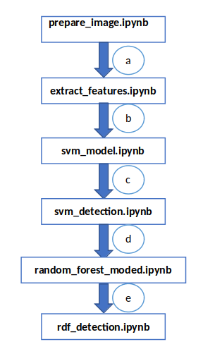

### Hog Implementation(Histogram of oriented Gradient)
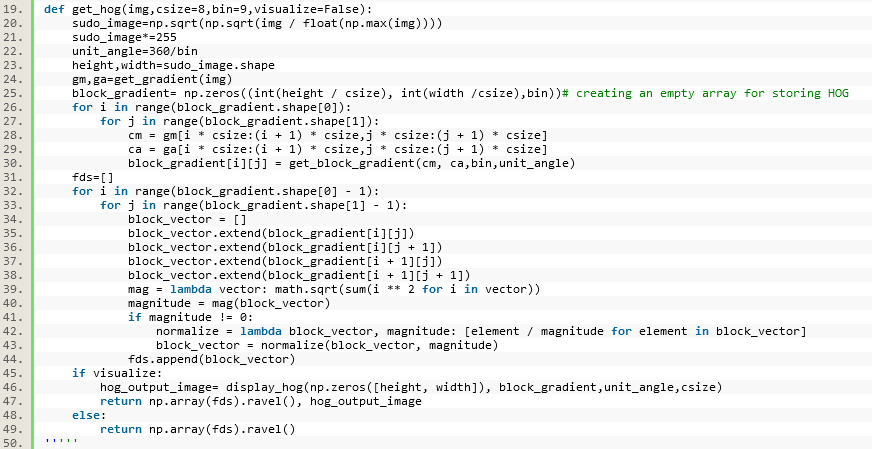

### Gradient Calculation(Gx, Gy, Magnitude , and orientation)
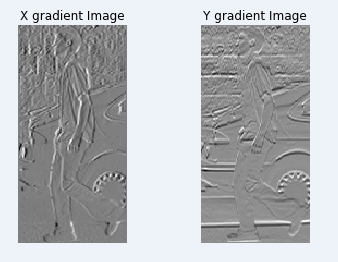
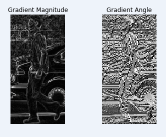

### HOG output Visualization(my implementation vs Skimage HOG implementation). Greyscale pixel values are used to represent magnitudes and arrows to represent orientations
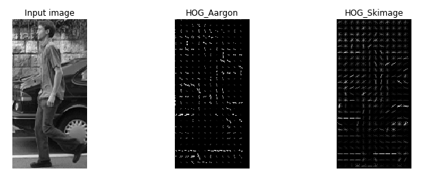
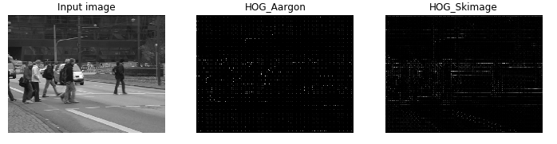
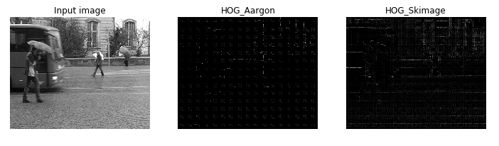
### Generate positive and negative instance. The positive and negative instances which are generated are kept in two separate directories 
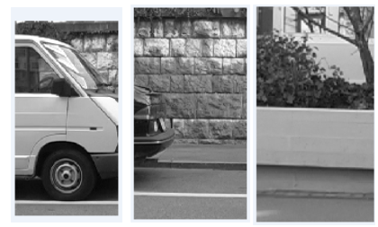
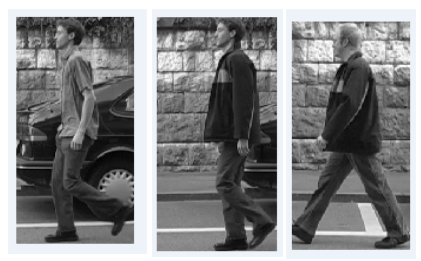

- `…\data\train_pos`
- `…\data\train_neg`

### Class-balanced random train/test split using sklearn.model_selection methods
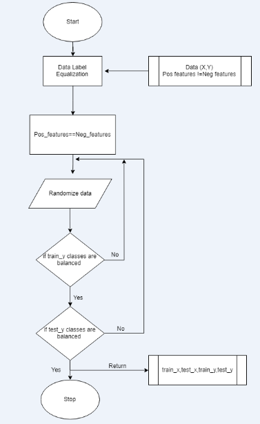

### Train an Sklearn random decision forest on feature vectors generated using your HOG function from (1)
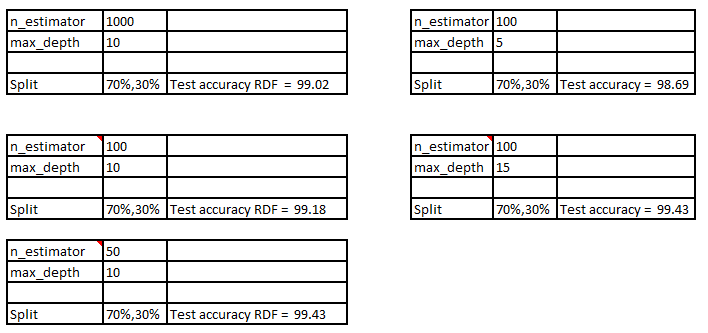
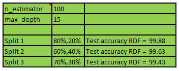

### Grid-based cross validation

`0.9969 (+/-0.0083) for {'max_depth': 5, 'n_estimators': 200}`  
`0.9979 (+/-0.0051) for {'max_depth': 5, 'n_estimators': 400}`  
`0.9969 (+/-0.0083) for {'max_depth': 5, 'n_estimators': 600}`  
`0.9969 (+/-0.0083) for {'max_depth': 5, 'n_estimators': 800}`  
`0.9969 (+/-0.0083) for {'max_depth': 5, 'n_estimators': 1000}`  
`0.9990 (+/-0.0041) for {'max_depth': 10, 'n_estimators': 200}`  
`0.9990 (+/-0.0041) for {'max_depth': 10, 'n_estimators': 400}`  
`0.9990 (+/-0.0041) for {'max_depth': 10, 'n_estimators': 600}`  
`0.9990 (+/-0.0041) for {'max_depth': 10, 'n_estimators': 800}`  
`0.9979 (+/-0.0051) for {'max_depth': 10, 'n_estimators': 1000}`  
- max_depth -> Change in max depth from 5 to 10 increased the grip score  

### Training an Sklearn support vector classifier on feature vectors generated using your HOG function from (1)
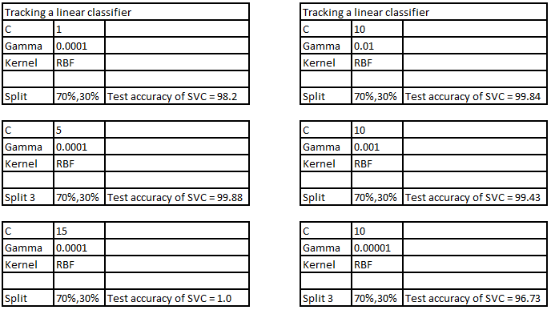
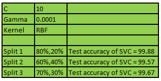

### Use grid-based cross validation to optimize the support vector classifier hyper parameters

`0.9884 (+/-0.0129) for {'C': 1, 'gamma': 0.01, 'kernel': 'rbf'}`  
`0.9705 (+/-0.0124) for {'C': 1, 'gamma': 0.001, 'kernel': 'rbf'}`  
`0.9457 (+/-0.0156) for {'C': 1, 'gamma': 0.0001, 'kernel': 'rbf'}`  
`0.9932 (+/-0.0099) for {'C': 10, 'gamma': 0.01, 'kernel': 'rbf'}`  
`0.9903 (+/-0.0148) for {'C': 10, 'gamma': 0.001, 'kernel': 'rbf'}`  
`0.9705 (+/-0.0124) for {'C': 10, 'gamma': 0.0001, 'kernel': 'rbf'}`  
`0.9932 (+/-0.0099) for {'C': 15, 'gamma': 0.01, 'kernel': 'rbf'}`  
`0.9932 (+/-0.0099) for {'C': 15, 'gamma': 0.001, 'kernel': 'rbf'}`  
`0.9742 (+/-0.0127) for {'C': 15, 'gamma': 0.0001, 'kernel': 'rbf'}`  
`0.9942 (+/-0.0113) for {'C': 1, 'kernel': 'linear'}`  
`0.9942 (+/-0.0113) for {'C': 10, 'kernel': 'linear'}`  
`0.9942 (+/-0.0113) for {'C': 15, 'kernel': 'linear'}` 
- It is both dependent on C and gamma parameter 

## Results

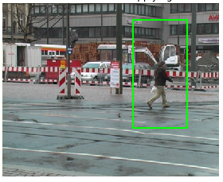
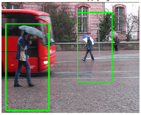
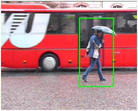
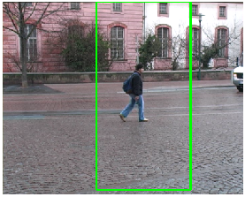
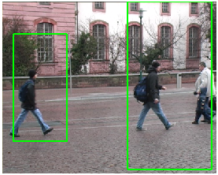
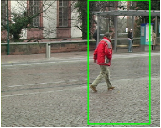
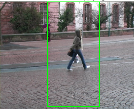

